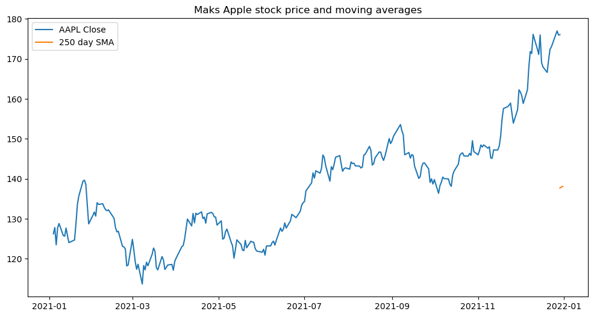

```python
!pip install yfinance
```

    Collecting yfinance
      Using cached yfinance-0.2.61-py2.py3-none-any.whl.metadata (5.8 kB)
    Requirement already satisfied: pandas>=1.3.0 in /Users/amakki/miniconda3/envs/new-matplot-venv/lib/python3.13/site-packages (from yfinance) (2.2.3)
    Requirement already satisfied: numpy>=1.16.5 in /Users/amakki/miniconda3/envs/new-matplot-venv/lib/python3.13/site-packages (from yfinance) (2.2.5)
    Requirement already satisfied: requests>=2.31 in /Users/amakki/miniconda3/envs/new-matplot-venv/lib/python3.13/site-packages (from yfinance) (2.32.3)
    Collecting multitasking>=0.0.7 (from yfinance)
      Using cached multitasking-0.0.11-py3-none-any.whl.metadata (5.5 kB)
    Requirement already satisfied: platformdirs>=2.0.0 in /Users/amakki/miniconda3/envs/new-matplot-venv/lib/python3.13/site-packages (from yfinance) (4.3.8)
    Requirement already satisfied: pytz>=2022.5 in /Users/amakki/miniconda3/envs/new-matplot-venv/lib/python3.13/site-packages (from yfinance) (2025.2)
    Collecting frozendict>=2.3.4 (from yfinance)
      Using cached frozendict-2.4.6-py313-none-any.whl.metadata (23 kB)
    Collecting peewee>=3.16.2 (from yfinance)
      Using cached peewee-3.18.1-cp313-cp313-macosx_10_13_x86_64.whl
    Requirement already satisfied: beautifulsoup4>=4.11.1 in /Users/amakki/miniconda3/envs/new-matplot-venv/lib/python3.13/site-packages (from yfinance) (4.13.4)
    Collecting curl_cffi>=0.7 (from yfinance)
      Using cached curl_cffi-0.11.1-cp39-abi3-macosx_10_9_x86_64.whl.metadata (14 kB)
    Collecting protobuf>=3.19.0 (from yfinance)
      Using cached protobuf-6.31.0-cp39-abi3-macosx_10_9_universal2.whl.metadata (593 bytes)
    Collecting websockets>=13.0 (from yfinance)
      Using cached websockets-15.0.1-cp313-cp313-macosx_10_13_x86_64.whl.metadata (6.8 kB)
    Requirement already satisfied: soupsieve>1.2 in /Users/amakki/miniconda3/envs/new-matplot-venv/lib/python3.13/site-packages (from beautifulsoup4>=4.11.1->yfinance) (2.7)
    Requirement already satisfied: typing-extensions>=4.0.0 in /Users/amakki/miniconda3/envs/new-matplot-venv/lib/python3.13/site-packages (from beautifulsoup4>=4.11.1->yfinance) (4.13.2)
    Requirement already satisfied: cffi>=1.12.0 in /Users/amakki/miniconda3/envs/new-matplot-venv/lib/python3.13/site-packages (from curl_cffi>=0.7->yfinance) (1.17.1)
    Requirement already satisfied: certifi>=2024.2.2 in /Users/amakki/miniconda3/envs/new-matplot-venv/lib/python3.13/site-packages (from curl_cffi>=0.7->yfinance) (2025.4.26)
    Requirement already satisfied: pycparser in /Users/amakki/miniconda3/envs/new-matplot-venv/lib/python3.13/site-packages (from cffi>=1.12.0->curl_cffi>=0.7->yfinance) (2.22)
    Requirement already satisfied: python-dateutil>=2.8.2 in /Users/amakki/miniconda3/envs/new-matplot-venv/lib/python3.13/site-packages (from pandas>=1.3.0->yfinance) (2.9.0.post0)
    Requirement already satisfied: tzdata>=2022.7 in /Users/amakki/miniconda3/envs/new-matplot-venv/lib/python3.13/site-packages (from pandas>=1.3.0->yfinance) (2025.2)
    Requirement already satisfied: six>=1.5 in /Users/amakki/miniconda3/envs/new-matplot-venv/lib/python3.13/site-packages (from python-dateutil>=2.8.2->pandas>=1.3.0->yfinance) (1.17.0)
    Requirement already satisfied: charset_normalizer<4,>=2 in /Users/amakki/miniconda3/envs/new-matplot-venv/lib/python3.13/site-packages (from requests>=2.31->yfinance) (3.4.2)
    Requirement already satisfied: idna<4,>=2.5 in /Users/amakki/miniconda3/envs/new-matplot-venv/lib/python3.13/site-packages (from requests>=2.31->yfinance) (3.10)
    Requirement already satisfied: urllib3<3,>=1.21.1 in /Users/amakki/miniconda3/envs/new-matplot-venv/lib/python3.13/site-packages (from requests>=2.31->yfinance) (2.4.0)
    Using cached yfinance-0.2.61-py2.py3-none-any.whl (117 kB)
    Using cached curl_cffi-0.11.1-cp39-abi3-macosx_10_9_x86_64.whl (5.7 MB)
    Using cached frozendict-2.4.6-py313-none-any.whl (16 kB)
    Using cached multitasking-0.0.11-py3-none-any.whl (8.5 kB)
    Using cached protobuf-6.31.0-cp39-abi3-macosx_10_9_universal2.whl (425 kB)
    Using cached websockets-15.0.1-cp313-cp313-macosx_10_13_x86_64.whl (173 kB)
    Installing collected packages: peewee, multitasking, websockets, protobuf, frozendict, curl_cffi, yfinance
       ━━━━━━━━━━━━━━━━━━━━━━━━━━━━━━━━━━━━━━━━ 7/7 [yfinance]6/7 [yfinance]]]
    Successfully installed curl_cffi-0.11.1 frozendict-2.4.6 multitasking-0.0.11 peewee-3.18.1 protobuf-6.31.0 websockets-15.0.1 yfinance-0.2.61


```python
import yfinance as yf
stock_data = yf.download('AAPL', start='2021-01-01', end='2022-01-01')
print(stock_data.head())
```

    YF.download() has changed argument auto_adjust default to True


    [*********************100%***********************]  1 of 1 completed

    Price            Close        High         Low        Open     Volume
    Ticker            AAPL        AAPL        AAPL        AAPL       AAPL
    Date                                                                 
    2021-01-04  126.239708  130.336813  123.654626  130.249021  143301900
    2021-01-05  127.800453  128.512580  125.283657  125.732395   97664900
    2021-01-06  123.498535  127.839523  123.283924  124.591100  155088000
    2021-01-07  127.712669  128.405282  124.727637  125.215388  109578200
    2021-01-08  128.815002  129.380795  127.039582  129.185683  105158200


    


```python
print(stock_data.tail(165))
print(stock_data.head(198))
```

    Price            Close        High         Low        Open     Volume
    Ticker            AAPL        AAPL        AAPL        AAPL       AAPL
    Date                                                                 
    2021-05-10  124.137825  126.770305  124.098679  126.643095   88071200
    2021-05-11  123.217926  123.570222  120.145055  120.859451  126142800
    2021-05-12  120.145065  121.975086  119.636187  120.761600  112172300
    2021-05-13  122.298019  123.452790  121.603201  121.916359  105861300
    2021-05-14  124.724991  125.155586  123.159202  123.550651   81918000
    ...                ...         ...         ...         ...        ...
    2021-12-27  176.996689  177.085022  173.796954  173.816573   74919600
    2021-12-28  175.975891  177.978191  175.229945  176.829820   79144300
    2021-12-29  176.064255  177.291149  174.847170  176.015176   62348900
    2021-12-30  174.906067  177.232269  174.798100  176.152596   59773000
    2021-12-31  174.287720  175.917024  173.983437  174.798097   64062300
    
    [165 rows x 5 columns]
    Price            Close        High         Low        Open     Volume
    Ticker            AAPL        AAPL        AAPL        AAPL       AAPL
    Date                                                                 
    2021-01-04  126.239708  130.336813  123.654626  130.249021  143301900
    2021-01-05  127.800453  128.512580  125.283657  125.732395   97664900
    2021-01-06  123.498535  127.839523  123.283924  124.591100  155088000
    2021-01-07  127.712669  128.405282  124.727637  125.215388  109578200
    2021-01-08  128.815002  129.380795  127.039582  129.185683  105158200
    ...                ...         ...         ...         ...        ...
    2021-10-08  140.054169  141.308677  139.720943  141.161670   58773200
    2021-10-11  139.965988  141.926159  138.985903  139.436749   64452200
    2021-10-12  138.691864  140.397218  138.231223  140.377612   73035900
    2021-10-13  138.103806  138.584038  136.427853  138.427235   78762700
    2021-10-14  140.897034  141.014654  138.691842  139.279899   69907100
    
    [198 rows x 5 columns]


```python
stock_data['Daily Return'] = stock_data['Close'].pct_change()
```


```python
print(stock_data.head(5))
```

    Price            Close        High         Low        Open     Volume  \
    Ticker            AAPL        AAPL        AAPL        AAPL       AAPL   
    Date                                                                    
    2021-01-04  126.239708  130.336813  123.654626  130.249021  143301900   
    2021-01-05  127.800453  128.512580  125.283657  125.732395   97664900   
    2021-01-06  123.498535  127.839523  123.283924  124.591100  155088000   
    2021-01-07  127.712669  128.405282  124.727637  125.215388  109578200   
    2021-01-08  128.815002  129.380795  127.039582  129.185683  105158200   
    
    Price      Daily Return  
    Ticker                   
    Date                     
    2021-01-04          NaN  
    2021-01-05     0.012363  
    2021-01-06    -0.033661  
    2021-01-07     0.034123  
    2021-01-08     0.008631  


```python
stock_data["Simple Moving Average_250"] = stock_data["Close"].rolling(window=250).mean()
```


```python
import matplotlib.pyplot as plt
plt.figure(figsize=(12, 6))
plt.plot(stock_data.head(250)['Close'], label='AAPL Close')
plt.plot(stock_data["Simple Moving Average_250"], label="250 day SMA")
plt.title('Maks Apple stock price and moving averages')
plt.legend()
plt.show()
```


    

    


```python

```
